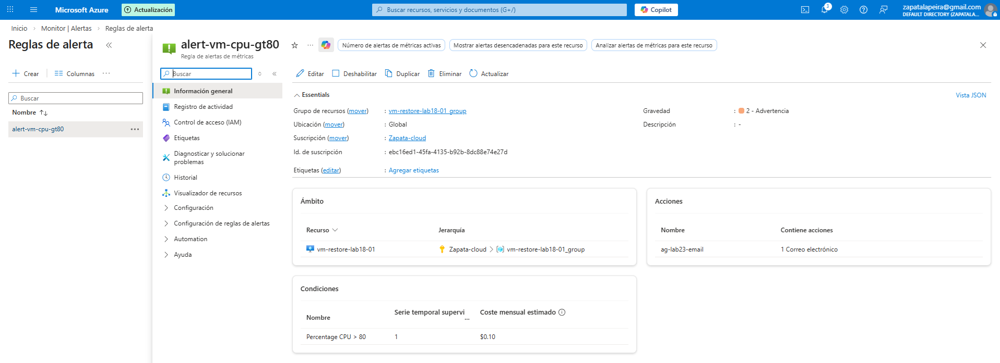

# Lab 23 – Azure Monitor: Alerta de CPU en máquina virtual

## Objetivo
Configurar una alerta en Azure Monitor para detectar un uso alto de CPU en una máquina virtual y recibir una notificación automática antes de que el rendimiento se degrade.

---

## Qué he hecho en este laboratorio

1. He creado una regla de alerta basada en métrica para una VM.
2. He definido la condición “CPU > 80%” como umbral de aviso.
3. He asociado un Action Group para recibir la notificación por email.

---

## Arquitectura y concepto

Azure Monitor permite crear alertas a partir de métricas (CPU, memoria, disco, red).  
En vez de enterarme por el usuario cuando el servidor va lento, configuro umbrales y notificaciones para actuar de forma proactiva.

---

## Configuración utilizada

- Recurso monitorizado: máquina virtual (VM del laboratorio)
- Señal (métrica): Percentage CPU
- Condición: Mayor que 80%
- Severidad: Sev 2 / Sev 3 (según criterio de operación)
- Acción: Action Group con notificación por email

---

## Validación funcional

La regla de alerta queda creada y activa, lista para dispararse cuando la CPU supere el umbral configurado.

---

## Evidencias

### 01 – Condición de alerta (CPU > 80%)

Se muestra el gráfico de la métrica y el umbral definido para disparar la alerta.

---

### 02 – Action Group (email)

Se muestra el Action Group configurado como canal de notificación.

---

### 03 – Confirmación de suscripción al Action Group (email de Azure)

Se muestra el correo de Microsoft Azure confirmando que el destinatario ha sido añadido correctamente al Action Group `ag-lab23-email`.

---

## Checklist de verificación

- [x] Regla de alerta creada para la VM
- [x] Condición definida: Percentage CPU > 80%
- [x] Action Group asociado
- [x] Notificación por email configurada
- [x] Evidencias guardadas y enlazadas en el README
- [x] Confirmación recibida de alta en el Action Group por correo
 
---

## Qué le diría a un cliente o en entrevista

“No espero a que el usuario me llame; configuro alertas para enterarme antes de que el servidor colapse o empiece a degradar por falta de recursos.”

---

